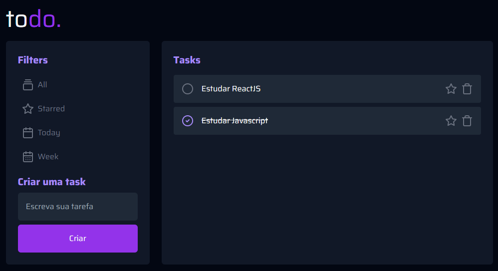

<h2 align="center">TODOLIST - React</h2>
<br>

<p align="center">
     <a href="#-tecnologias">Tecnologias</a> • 
     <a href="#-features">Features</a> • 
     <a href="#-como-usar">Como usar</a> •     
     <a href="#-colaboradores">Colaboradores</a> •
     <a href="#-licença">Licença</a> 
</p>

<br>

Este é um simples aplicativo de lista de tarefas (todolist) construído usando React e TypeScript. O aplicativo possui funcionalidades básicas, como criar uma tarefa, marcá-la como concluída e excluí-la.

O propósito fundamental deste aplicativo foi solidificar os conceitos essenciais em React, tais como a criação de componentes, a habilidade de importar e exportar esses componentes, a prática de compartilhar propriedades entre diferentes elementos, a implementação de renderização condicional, a manipulação de listas por meio de renderização dinâmica e, por fim, a utilização eficaz dos hooks useState e useEffect.

<br>

## 🌄 Layout



<br>

## ✅ Features

- Adicionar uma nova tarefa
- Marcar e desmarcar uma tarefa como concluída
- Remover uma tarefa da listagem

<br>

## 🛠 Tecnologias

Abaixo tecnologias que foram usadas no projeto:

- Vite JS
- React JS
- Typescript
- Html
- Tailwind CSS
- Git e Github
- Vercel

<br>

## 💿 Como usar

### ✅ Pré-requisitos

Antes de começar, você vai precisar ter instalado em sua máquina as seguintes ferramentas:
[Git](https://git-scm.com), [Node.js](https://nodejs.org/en/).
Além disto é bom ter um editor para trabalhar com o código como [VSCode](https://code.visualstudio.com/)

### 🎬 Rodando projeto

```bash
# Clone este repositório
git clone https://github.com/brunogoncalvesferreira/ignite-todolist.git

# Acesse a pasta do projeto
cd ignite-feed

# Instale as dependências
pnpm install

# Start server
pnpm run dev

# O servidor inciará na porta:3000 - acesse <http://localhost:3000>
```

<br>

## 👨‍💻 Colaboradores

<table>
    <tr>
         <td align="center"><a href="https://brunogoncalvesferreira.com"><br /><sub><b>Bruno Gonçalves</b></sub></a><br /><a href="https://brunogoncalvesferreira.com" title="Bruno Gonçalves Ferreira">👨‍🚀</a></td>
    </tr>
</table>

<br>

## ✅ Licença

[MIT](https://choosealicense.com/licenses/mit/)